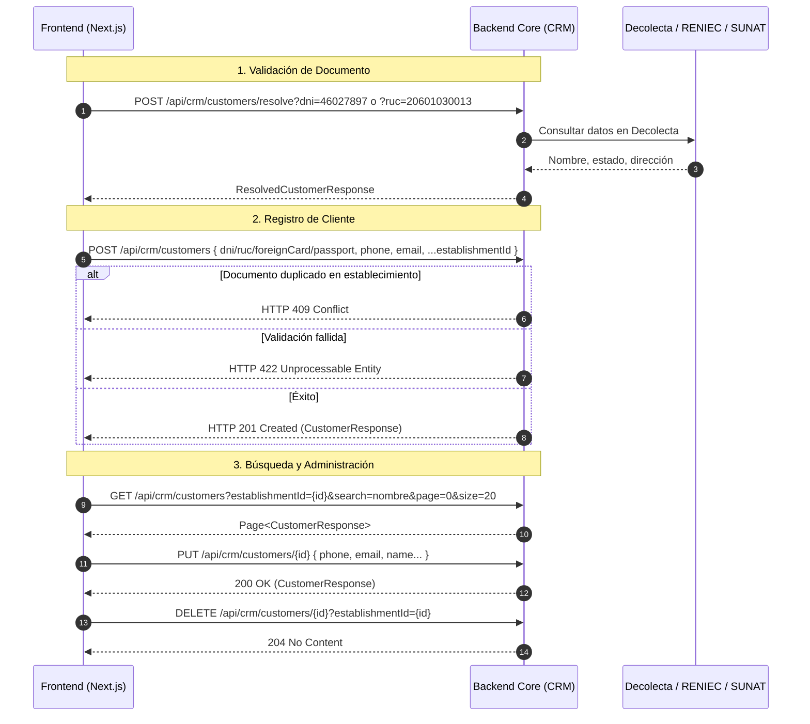

# Documentación de API - Contexto de CRM (Gestión de Clientes)

Esta documentación describe la especificación técnica completa para consumir los servicios REST del contexto delimitado de **CRM** (Customer Relationship Management) en la plataforma **Takodu**, incluyendo reglas de negocio, validaciones de documentos de identidad, integración con servicios externos (Decolecta, RENIEC, SUNAT), y modelos TypeScript listos para proyectos **Next.js**.

---

## 1. Reglas de Negocio y Arquitectura

### 1.1. Tipos de Documentos de Identidad
El CRM soporta múltiples tipos de documentos para registrar clientes según su nacionalidad y tipo:
- **DNI (Documento Nacional de Identidad)**: Documento de identidad peruano. Validado a través de **Decolecta** + **RENIEC**.
- **RUC (Registro Único del Contribuyente)**: Número de identificación fiscal peruano. Validado a través de **Decolecta** + **SUNAT**.
- **Carné de Extranjería (Foreign Resident Card)**: Documento para residentes extranjeros en Perú. Ingreso manual.
- **Pasaporte**: Documento de viaje internacional. Ingreso manual (nombre y datos ingresados manualmente).

### 1.2. Resolución de Identidad (DNI/RUC)
Antes de registrar un cliente con DNI o RUC:
1. Invocar `POST /api/crm/customers/resolve` con el documento.
2. El servicio valida el documento a través de **Decolecta** y recupera:
   - Nombre completo
   - Estado de contribuyente (ACTIVO, BAJA, SUSPENSIÓN)
   - Condición de contribuyente (Persona Natural, Empresa, etc.)
   - Dirección fiscal
3. El frontend presenta estos datos para confirmación del usuario.
4. Si el documento es inválido o no existe, retorna HTTP `422 Unprocessable Entity`.

### 1.3. Registro de Clientes
- **Clientes con DNI/RUC**: Datos validados se recuperan de Decolecta; nombre y dirección pueden ser editados manualmente si es necesario.
- **Clientes con Pasaporte o Carné de Extranjería**: Todos los datos (nombre, teléfono, email, dirección) se ingresan manualmente sin validación externa.
- **Relación con Establecimiento**: Cada cliente se registra para un `establishmentId` específico. Múltiples clientes pueden existir en múltiples establecimientos.
- **Unicidad de Documento**: Un mismo documento (DNI/RUC) no puede estar registrado dos veces en el mismo establecimiento; el sistema rechaza con HTTP `409 Conflict` (`CustomerDocumentConflictException`).

### 1.4. Ciclo de Vida del Cliente
- **Clientes Activos**: Estado por defecto tras registro. Solo se muestran clientes activos en búsquedas y consultas.
- **Eliminación Lógica (Soft-Delete)**: Al invocar `DELETE /{id}`, el cliente se marca como inactivo pero permanece en la BD para auditoría.
- **Campos de Auditoría**: Todos los clientes incluyen timestamps de creación y actualización.

---

## 2. Diagrama de Casos de Uso del Frontend



---

## 3. Especificación de Endpoints REST - Clientes (`/api/crm/customers`)

Base URL: `/api/crm/customers`

### 3.1. Resolver Documento (Validar DNI/RUC) (`POST /api/crm/customers/resolve`)
Valida un documento de identidad (DNI o RUC) a través de Decolecta y recupera datos del registro.

- **Método**: `POST`
- **Path**: `/api/crm/customers/resolve`
- **Headers**: `Content-Type: application/json`

#### Parámetros de Consulta (Query Params)
| Parámetro | Tipo | Requerido | Descripción |
| :--- | :--- | :---: | :--- |
| `dni` | `string` | Condicional | DNI peruano (8 dígitos). Proporciona `dni` O `ruc`. |
| `ruc` | `string` | Condicional | RUC peruano (11 dígitos). Proporciona `dni` O `ruc`. |

#### Ejemplo de Petición
```
POST /api/crm/customers/resolve?dni=46027897
```

#### Respuestas HTTP
- **`200 OK`**: Documento validado exitosamente. Retorna `ResolvedCustomerResponse`.
- **`422 Unprocessable Entity`**: Documento inválido o no encontrado en Decolecta.

#### Ejemplo de Respuesta
```json
{
  "documentNumber": "46027897",
  "name": "Juan Pérez García",
  "taxpayerStatus": "ACTIVO",
  "taxpayerCondition": "Persona Natural"
}
```

---

### 3.2. Registrar Cliente (`POST /api/crm/customers`)
Crea un nuevo cliente en un establecimiento. Para documentos DNI/RUC, se recomienda validar primero mediante `/resolve`.

- **Método**: `POST`
- **Path**: `/api/crm/customers`
- **Headers**: `Content-Type: application/json`

#### Cuerpo de la Petición (`RegisterCustomerRequest`)
```json
{
  "dni": "46027897",
  "ruc": null,
  "foreignResidentCard": null,
  "passport": null,
  "name": "Juan Pérez García",
  "phone": "+51987654321",
  "email": "juan@example.com",
  "establishmentId": "11223344-5566-7788-9900-aabbccddeeff"
}
```

#### Validaciones del Cuerpo
- **Documento**: Se debe proporcionar **exactamente uno** de: `dni`, `ruc`, `foreignResidentCard`, o `passport`.
  - Si se proporciona `dni` o `ruc`: validados a través de Decolecta. `name` es recuperado automáticamente.
  - Si se proporciona `foreignResidentCard` o `passport`: `name` debe ser proporcionado manualmente.
- `phone`: Formato recomendado `+51XXXXXXXXX`; máx. 15 caracteres.
- `email`: Email válido (validación RFC 5322).
- `establishmentId`: UUID válido del establecimiento; establecimiento debe existir y estar activo.

#### Respuestas HTTP
- **`201 Created`**: Cliente registrado exitosamente. Retorna `CustomerResponse`.
- **`400 Bad Request`**: Validación fallida en los datos (ej. email inválido, múltiples documentos).
- **`404 Not Found`**: Establecimiento no existe o está inactivo.
- **`409 Conflict`**: Documento ya registrado en el mismo establecimiento (`CustomerDocumentConflictException`).
- **`422 Unprocessable Entity`**: Documento inválido o validación de Decolecta falló (`CustomerDocumentValidationException`).

---

### 3.3. Buscar Clientes (`GET /api/crm/customers`)
Busca clientes activos del establecimiento por nombre, documento, teléfono o email.

- **Método**: `GET`
- **Path**: `/api/crm/customers`
- **Headers**: Ninguno requerido

#### Parámetros de Consulta (Query Params)
| Parámetro | Tipo | Requerido | Default | Descripción |
| :--- | :--- | :---: | :---: | :--- |
| `establishmentId` | `string` (UUID) | **Sí** | - | ID del establecimiento. |
| `search` | `string` | No | `""` | Búsqueda por nombre, documento, teléfono o email. |
| `page` | `integer` | No | `0` | Número de página (0-indexed). |
| `size` | `integer` | No | `20` | Tamaño de página (máximo 100). |

#### Respuestas HTTP
- **`200 OK`**: Retorna página con clientes (`Page<CustomerResponse>`).
- **`400 Bad Request`**: Parámetros de paginación inválidos.
- **`404 Not Found`**: Establecimiento no existe o está inactivo.

#### Ejemplo de Petición
```
GET /api/crm/customers?establishmentId=11223344-5566-7788-9900-aabbccddeeff&search=Juan&page=0&size=20
```

#### Ejemplo de Respuesta
```json
{
  "content": [
    {
      "id": "a1b2c3d4-e5f6-7890-abcd-123456789012",
      "organizationId": "f47ac10b-58cc-4372-a567-0e02b2c3d4e5",
      "establishmentId": "11223344-5566-7788-9900-aabbccddeeff",
      "documentType": "DNI",
      "documentNumber": "46027897",
      "name": "Juan Pérez García",
       "phone": "+51987654321",
       "email": "juan@example.com",
       "taxpayerStatus": "ACTIVO",
       "taxpayerCondition": "Persona Natural"
    }
  ],
  "pageable": { "pageNumber": 0, "pageSize": 20 },
  "totalPages": 1,
  "totalElements": 1,
  "last": true
}
```

---

### 3.4. Obtener Cliente por ID (`GET /api/crm/customers/{id}`)
Obtiene un cliente activo específico por su ID.

- **Método**: `GET`
- **Path**: `/api/crm/customers/{id}`
- **Headers**: Ninguno requerido

#### Parámetros de Consulta
| Parámetro | Tipo | Requerido | Descripción |
| :--- | :--- | :---: | :--- |
| `establishmentId` | `string` (UUID) | **Sí** | ID del establecimiento (para verificar pertenencia). |

#### Respuestas HTTP
- **`200 OK`**: Cliente encontrado. Retorna `CustomerResponse`.
- **`404 Not Found`**: Cliente no encontrado o no pertenece al establecimiento.

#### Ejemplo de Petición
```
GET /api/crm/customers/a1b2c3d4-e5f6-7890-abcd-123456789012?establishmentId=11223344-5566-7788-9900-aabbccddeeff
```

---

### 3.5. Actualizar Cliente (`PUT /api/crm/customers/{id}`)
Edita los datos de un cliente activo. Para documentos DNI/RUC, se valida a través de Decolecta; datos de contacto se actualizan manualmente.

- **Método**: `PUT`
- **Path**: `/api/crm/customers/{id}`
- **Headers**: `Content-Type: application/json`

#### Cuerpo de la Petición (`UpdateCustomerRequest`)
```json
{
  "dni": "46027897",
  "ruc": null,
  "foreignResidentCard": null,
  "passport": null,
  "name": "Juan Pérez García Actualizado",
  "phone": "+51987654999",
  "email": "juan.updated@example.com",
  "establishmentId": "11223344-5566-7788-9900-aabbccddeeff"
}
```

#### Validaciones
- Mismas reglas que el registro (`RegisterCustomerRequest`).
- Si se cambia el documento, debe ser único en el establecimiento (no duplicado).

#### Respuestas HTTP
- **`200 OK`**: Cliente actualizado exitosamente. Retorna `CustomerResponse`.
- **`400 Bad Request`**: Validación fallida.
- **`404 Not Found`**: Cliente no encontrado.
- **`409 Conflict`**: Nuevo documento duplicado en el establecimiento.
- **`422 Unprocessable Entity`**: Validación de documento falló.

---

### 3.6. Eliminar Cliente (Soft-Delete) (`DELETE /api/crm/customers/{id}`)
Marca un cliente como inactivo (eliminación lógica). El cliente permanece en la BD para auditoría pero no aparece en búsquedas.

- **Método**: `DELETE`
- **Path**: `/api/crm/customers/{id}`
- **Headers**: Ninguno requerido

#### Parámetros de Consulta
| Parámetro | Tipo | Requerido | Descripción |
| :--- | :--- | :---: | :--- |
| `establishmentId` | `string` (UUID) | **Sí** | ID del establecimiento (verificación de pertenencia). |

#### Respuestas HTTP
- **`204 No Content`**: Cliente eliminado lógicamente.
- **`404 Not Found`**: Cliente no encontrado.

#### Ejemplo de Petición
```
DELETE /api/crm/customers/a1b2c3d4-e5f6-7890-abcd-123456789012?establishmentId=11223344-5566-7788-9900-aabbccddeeff
```

---

## 4. Modelos JSON / TypeScript para Frontend

```typescript
// types/crm.ts

export type CustomerDocumentType = 'DNI' | 'RUC' | 'FOREIGN_RESIDENT_CARD' | 'PASSPORT';

export interface ResolvedCustomerData {
  documentNumber: string;
  name: string;
  taxpayerStatus: string;
  taxpayerCondition: string;
}

export interface CustomerResponse {
  id: string;
  organizationId: string;
  establishmentId: string;
  documentType: CustomerDocumentType;
  documentNumber: string;
  name: string;
  phone: string;
  email: string;
  taxpayerStatus?: string | null;
  taxpayerCondition?: string | null;
}

export interface RegisterCustomerRequest {
  dni?: string | null;
  ruc?: string | null;
  foreignResidentCard?: string | null;
  passport?: string | null;
  name?: string; // required for foreign docs, auto-filled for DNI/RUC
  phone: string;
  email: string;
  establishmentId: string;
}

export interface UpdateCustomerRequest {
  dni?: string | null;
  ruc?: string | null;
  foreignResidentCard?: string | null;
  passport?: string | null;
  name?: string;
  phone: string;
  email: string;
  establishmentId: string;
}

export interface CustomerSearchParams {
  establishmentId: string;
  search?: string;
  page?: number;
  size?: number;
}

export interface PageResponse<T> {
  content: T[];
  pageable: { pageNumber: number; pageSize: number };
  totalPages: number;
  totalElements: number;
  last: boolean;
}
```

---

## 5. Ejemplo de Cliente API (Next.js)

```typescript
// services/crmApi.ts
import {
  CustomerResponse,
  RegisterCustomerRequest,
  UpdateCustomerRequest,
  CustomerSearchParams,
  ResolvedCustomerData,
  PageResponse
} from '@/types/crm';

const BASE_URL = process.env.NEXT_PUBLIC_API_URL || 'http://localhost:8080';

export const crmApi = {
  async resolveDocument(dni?: string, ruc?: string): Promise<ResolvedCustomerData> {
    const query = new URLSearchParams();
    if (dni) query.append('dni', dni);
    if (ruc) query.append('ruc', ruc);
    const res = await fetch(`${BASE_URL}/api/crm/customers/resolve?${query.toString()}`, { method: 'POST' });
    if (!res.ok) throw new Error('Error validating document');
    return res.json();
  },

  async registerCustomer(req: RegisterCustomerRequest): Promise<CustomerResponse> {
    const res = await fetch(`${BASE_URL}/api/crm/customers`, {
      method: 'POST',
      headers: { 'Content-Type': 'application/json' },
      body: JSON.stringify(req)
    });
    if (!res.ok) {
      const err = await res.json();
      throw new Error(err.message || 'Error registering customer');
    }
    return res.json();
  },

  async searchCustomers(params: CustomerSearchParams): Promise<PageResponse<CustomerResponse>> {
    const q = new URLSearchParams();
    q.append('establishmentId', params.establishmentId);
    if (params.search) q.append('search', params.search);
    q.append('page', String(params.page ?? 0));
    q.append('size', String(params.size ?? 20));
    const res = await fetch(`${BASE_URL}/api/crm/customers?${q.toString()}`);
    if (!res.ok) throw new Error('Error searching customers');
    return res.json();
  },

  async getCustomer(id: string, establishmentId: string): Promise<CustomerResponse> {
    const res = await fetch(`${BASE_URL}/api/crm/customers/${id}?establishmentId=${establishmentId}`);
    if (!res.ok) throw new Error('Customer not found');
    return res.json();
  },

  async updateCustomer(id: string, req: UpdateCustomerRequest): Promise<CustomerResponse> {
    const res = await fetch(`${BASE_URL}/api/crm/customers/${id}`, {
      method: 'PUT',
      headers: { 'Content-Type': 'application/json' },
      body: JSON.stringify(req)
    });
    if (!res.ok) {
      const err = await res.json();
      throw new Error(err.message || 'Error updating customer');
    }
    return res.json();
  },

  async deleteCustomer(id: string, establishmentId: string): Promise<void> {
    const res = await fetch(`${BASE_URL}/api/crm/customers/${id}?establishmentId=${establishmentId}`, { method: 'DELETE' });
    if (!res.ok) throw new Error('Error deleting customer');
  }
};
```

---

## 6. Notas Finales

- **Decolecta Integration**: Errores en la validación de documentos (DNI/RUC) retornan `422 Unprocessable Entity`. Estos son errores de datos, no del servidor.
- **Soft-Delete**: Clientes eliminados permanecen en la BD con estado inactivo. No aparecen en búsquedas pero se pueden restaurar manualmente si es necesario.
- **Unicidad por Establecimiento**: Documentos deben ser únicos **por establecimiento**. El mismo cliente (DNI) puede registrarse en múltiples establecimientos.
- **Validación de Email**: Se valida formato RFC 5322; algunos emails muy complejos podrían ser rechazados.
- **Paginación**: Máximo 100 elementos por página. Parámetros inválidos retornan `400 Bad Request`.

---
