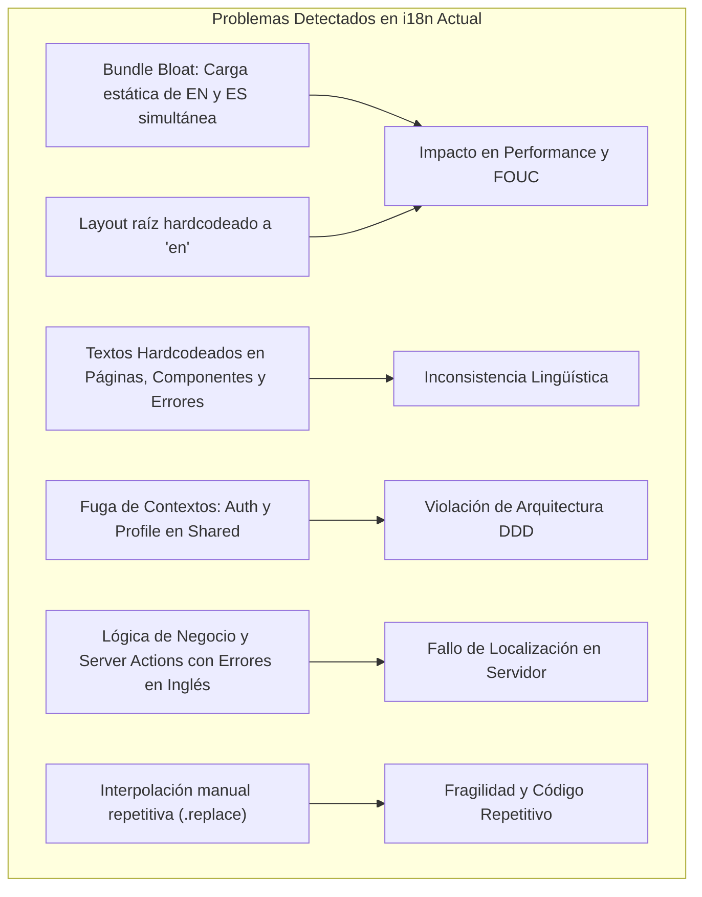
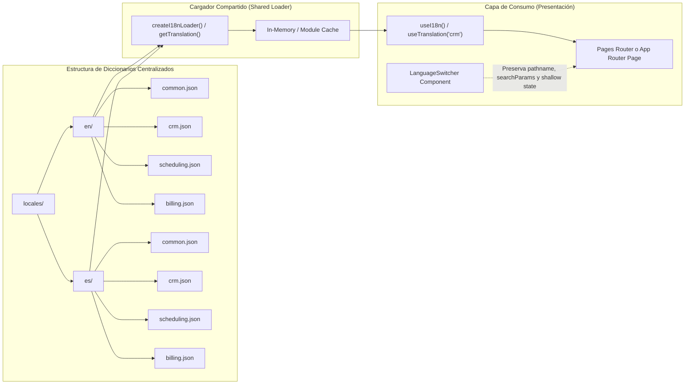

# Auditoría Técnica de Internacionalización (i18n) y Plan de Refactorización

**Proyecto:** Takodu / Gremory (Next.js)  
**Fecha:** 20 de septiembre de 2026  
**Estado:** Auditoría completada — Pendiente de aprobación antes de ejecución  

---

## 1. Diagnóstico Inicial y Discrepancia Arquitectónica

> [!CAUTION]
> ### Conflicto Arquitectónico Fundamental: Pages Router vs. App Router
> 
> La solicitud estipula:
> > *"El proyecto utiliza Pages Router, por lo que los idiomas deben configurarse globalmente en `next.config.js` mediante `i18n.locales` y `defaultLocale`; cada página debe conservar una única implementación dentro de `pages/` y obtener el idioma activo mediante `locale` en `getStaticProps`, `getServerSideProps` o `useRouter`, sin duplicar páginas por idioma."*
>
> **Hallazgo técnico en el repositorio:**
> 1. El proyecto se encuentra actualmente en **Next.js 16.3.4 con React 19.2.8** y está construido al 100% sobre **App Router** dentro del directorio [`app/`](file:///home/giks/projects/09641061/gremory/app).
> 2. No existe ningún directorio `pages/` en la raíz ni en el historial de Git (691 commits).
> 3. En [`next.config.ts`](file:///home/giks/projects/09641061/gremory/next.config.ts#L1-L11), la propiedad `i18n` **no está configurada**. En Next.js App Router, la configuración `i18n: { locales, defaultLocale }` de `next.config.js` es **incompatible y rechazada en tiempo de compilación**, ya que fue diseñada exclusivamente para Pages Router.
> 4. Actualmente, el proyecto utiliza una solución ad-hoc basada en cookies de cliente (`takodu_locale`), detección de cabeceras en [`server.ts`](file:///home/giks/projects/09641061/gremory/contexts/shared/infrastructure/i18n/server.ts), y un Contexto de React de cliente [`I18nProvider`](file:///home/giks/projects/09641061/gremory/contexts/shared/interfaces/i18n/i18n-provider.tsx) montado en [`app/layout.tsx`](file:///home/giks/projects/09641061/gremory/app/layout.tsx).
>
> En esta auditoría se analizan a fondo las dos vías de resolución:
> - **Vía A (Requisito Estricto - Migración a Pages Router):** Migración de rutas hacia `pages/` y activación de `i18n` nativo en `next.config.js`.
> - **Vía B (Evolución Estándar sobre App Router):** Centralización de diccionarios, proxy/middleware con subpath/cookie routing y cargador modular lazy sin destruir la infraestructura actual de App Router.

---

## 2. Análisis Detallado de los 8 Ejes de Auditoría



### 2.1. Carga Completa e Innecesaria de Traducciones (Bundle Bloat)
* **Archivo origen:** [`contexts/*/interfaces/i18n/index.ts`](file:///home/giks/projects/09641061/gremory/contexts/crm/interfaces/i18n/index.ts#L5-L16) y [`contexts/shared/infrastructure/i18n/locales/index.ts`](file:///home/giks/projects/09641061/gremory/contexts/shared/infrastructure/i18n/locales/index.ts#L2-L16).
* **Mecanismo defectuoso:** Cada módulo importa estáticamente ambos archivos de idiomas:
  ```typescript
  import { en } from "./locales/en";
  import { es } from "./locales/es";
  export const crmLocales = { en, es };
  ```
* **Impacto:** Si un usuario entra a la aplicación configurada en español, el navegador descarga el 100% de los diccionarios en inglés y en español de cada módulo visitado, duplicando el peso en bytes de los textos y bloqueando el tree-shaking del empaquetador (Webpack/Turbopack).

### 2.2. Pérdida de Idioma y Desincronización en la Navegación (FOUC & SSR Mismatch)
* **Archivo origen:** [`app/layout.tsx`](file:///home/giks/projects/09641061/gremory/app/layout.tsx#L22-L26) y [`contexts/shared/interfaces/i18n/i18n-provider.tsx`](file:///home/giks/projects/09641061/gremory/contexts/shared/interfaces/i18n/i18n-provider.tsx#L95-L121).
* **Mecanismo defectuoso:**
  1. [`app/layout.tsx`](file:///home/giks/projects/09641061/gremory/app/layout.tsx#L22-L26) define de forma fija `<html lang="en">` y `<I18nProvider initialLocale="en">`. No consulta [`getServerLocale()`](file:///home/giks/projects/09641061/gremory/contexts/shared/infrastructure/i18n/server.ts#L8) durante el renderizado en el servidor.
  2. Cuando el cliente se hidrata en el navegador, un `useEffect` en [`I18nProvider`](file:///home/giks/projects/09641061/gremory/contexts/shared/interfaces/i18n/i18n-provider.tsx#L102-L121) inspecciona la cookie o `navigator.language` y ejecuta `setLocaleState(detected)` dentro de un `queueMicrotask`.
* **Impacto:** 
  - **Flash of Unlocalized Content (FOUC):** Todo usuario de habla hispana ve la interfaz parpadear de inglés a español al recargar.
  - **Mala indexación SEO:** Los motores de búsqueda reciben siempre HTML en inglés.
  - **Imposibilidad de compartir enlaces con idioma explícito:** Las URLs no contienen prefijo (`/es` o `/en`), por lo que compartir un enlace no preserva el idioma seleccionado.

### 2.3. Textos Hardcodeados en Vistas y Componentes Clave
Se identificaron múltiples pantallas y componentes donde no se invocan los diccionarios:
1. [`app/(protected)/(app)/team/page.tsx`](file:///home/giks/projects/09641061/gremory/app/%28protected%29/%28app%29/team/page.tsx#L6): `<PageHeader title="Team" />` en inglés fijo.
2. [`app/(protected)/(app)/chat/page.tsx`](file:///home/giks/projects/09641061/gremory/app/%28protected%29/%28app%29/chat/page.tsx#L68-L85): Mensajes de estado y denegación de módulos (`"Access Denied"`, `"You do not have permission to access the CRM module."`, `"Workspace ready"`).
3. [`app/(protected)/(configuration)/permissions/page.tsx`](file:///home/giks/projects/09641061/gremory/app/%28protected%29/%28configuration%29/permissions/page.tsx#L6): `<PageHeader title="Permissions" />` en inglés fijo.
4. [`app/(protected)/(app)/establishments/setup/page.tsx`](file:///home/giks/projects/09641061/gremory/app/%28protected%29/%28app%29/establishments/setup/page.tsx#L42-L60): Títulos y botones completamente en inglés (`"Set up your first establishment"`, `"Create establishment"`, `"Manage organizations"`).
5. Pantallas de Error (`app/error.tsx`, `app/(protected)/error.tsx`, `app/(protected)/(app)/error.tsx`): Título `"Something went wrong"` y mensaje `"We could not complete this request. Please try again."` fijos.
6. [`contexts/shared/interfaces/components/feedback/error-screen.tsx`](file:///home/giks/projects/09641061/gremory/contexts/shared/interfaces/components/feedback/error-screen.tsx#L23-L24): Propiedades por defecto `retryLabel = "Try again"` y `retryingLabel = "Retrying..."`.
7. [`contexts/shared/interfaces/components/dialogs/delete-confirm-dialog.tsx`](file:///home/giks/projects/09641061/gremory/contexts/shared/interfaces/components/dialogs/delete-confirm-dialog.tsx#L54-L96): Botón `"Cancel"` fijo, concatenación gramatical inglesa (`"Unable to " + confirmLabel + " " + entityLabel`, `"This will permanently " + ...`). En español genera frases híbridas: *"Delete categoría?"* o *"This will permanently delete Corte ejecutivo"*.
8. [`contexts/billing/interfaces/components/subscribe/subscribe-view.tsx`](file:///home/giks/projects/09641061/gremory/contexts/billing/interfaces/components/subscribe/subscribe-view.tsx#L54-L76): `PLAN_METADATA` con descripciones y características fijas en inglés (`"Perfect for startups and local shops."`, `"Core billing tools"`).
9. [`contexts/analytics/interfaces/components/max/max-analytics-view.tsx`](file:///home/giks/projects/09641061/gremory/contexts/analytics/interfaces/components/max/max-analytics-view.tsx#L73-L90): Cabeceras CSV hardcodeadas en español (`["Fecha", "Ingresos Facturados", "Citas Totales"]`) y formateador de moneda fijo en `"es-PE"`, ignorando si el usuario eligió inglés.
10. [`contexts/scheduling/interfaces/components/scheduling-datetime.ts`](file:///home/giks/projects/09641061/gremory/contexts/scheduling/interfaces/components/scheduling-datetime.ts#L67): `date.toLocaleTimeString("en-US", ...)` formatea horarios exclusivamente bajo convención estadounidense de 12 horas AM/PM.
11. [`contexts/assistant/interfaces/components/sidebar/assistant-chats-section.tsx`](file:///home/giks/projects/09641061/gremory/contexts/assistant/interfaces/components/sidebar/assistant-chats-section.tsx#L62-L107): `<span>Chats</span>` y `"New conversation"` fijos.

### 2.4. Traducciones Mezcladas con Lógica de Negocio y Server Actions
* **Esquemas Zod:** En [`contexts/crm/interfaces/schemas/customer-identity.schema.ts`](file:///home/giks/projects/09641061/gremory/contexts/crm/interfaces/schemas/customer-identity.schema.ts#L10-L49), las validaciones definen strings fijos en inglés (`"Name is required"`, `"Provide exactly one identity document"`, etc.), a pesar de que el diccionario [`contexts/crm/interfaces/i18n/locales/es.ts`](file:///home/giks/projects/09641061/gremory/contexts/crm/interfaces/i18n/locales/es.ts#L74-L82) posee claves equivalentes.
* **Server Actions:**
  - [`contexts/scheduling/interfaces/actions/create-appointment.action.ts`](file:///home/giks/projects/09641061/gremory/contexts/scheduling/interfaces/actions/create-appointment.action.ts#L34-L72): Devuelve mensajes de error en inglés (`"Please fix the validation errors below."`, `"There is a scheduling conflict at this time..."`).
  - [`contexts/catalog/interfaces/actions/manage-catalog-service.actions.ts`](file:///home/giks/projects/09641061/gremory/contexts/catalog/interfaces/actions/manage-catalog-service.actions.ts#L53-L96): Devuelve `"Error while updating the service"`, `"Error while changing the service status"`.
  - Las acciones del servidor no resuelven el `locale` del usuario ni emiten códigos de error semánticos (`CONFLICT_APPOINTMENT`, `UNAUTHORIZED`), impidiendo la traducción en la capa de presentación.
* **Validación que rompe el idioma:** En [`contexts/business/interfaces/components/organization/create-organization/create-organization-form.tsx`](file:///home/giks/projects/09641061/gremory/contexts/business/interfaces/components/organization/create-organization/create-organization-form.tsx#L60), la sanitización `replace(/[^a-zA-Z]/g, "")` borra caracteres válidos del español (`ñ`, tildes, diéresis), contradiciendo el soporte del idioma.

### 2.5. Diccionarios Desorganizados y Ruptura de Bounded Contexts
* **Fuga de Dominios hacia Shared:** [`contexts/shared/infrastructure/i18n/locales/en.ts`](file:///home/giks/projects/09641061/gremory/contexts/shared/infrastructure/i18n/locales/en.ts#L33-L90) contiene:
  - `auth`: Perteneciente al bounded context `IAM` (el cual ni siquiera tiene carpeta `interfaces/i18n`).
  - `profile` y `preferences`: Pertenecientes al bounded context `Profiles`.
  - `onboarding`: Flujos de activación de negocio y suscripción.
* **Dependencias Circulares:**
  - En [`contexts/crm/interfaces/i18n/locales/index.ts`](file:///home/giks/projects/09641061/gremory/contexts/crm/interfaces/i18n/locales/index.ts#L1), se re-exporta `CrmDictionary` desde `../index.ts`, el cual a su vez importa `locales/es.ts`, el cual importa de `locales/index.ts`. Lo mismo ocurre en `scheduling`.

### 2.6. Claves Inconsistentes y Duplicación Excesiva
Se detectó una proliferación masiva de términos comunes redundantes que ya existían en `shared.common`:
- `"Cancel"` está definido **13 veces** distintas (`common.cancel`, `preferences.cancel`, `crm.form.cancel`, `catalog.dialogs.cancel`, `scheduling.form.cancel`, `business.establishments.cancelButton`, etc.).
- `"Save"` está definido **7 veces**.
- `"Saving..."` está definido **9 veces**.
- `"Delete"` está definido **7 veces**.
- Claves con convenciones dispares: `cancel` vs `cancelButton`, `save` vs `saveCustomer`, `create` vs `createButton`.
- En `shared`: se duplican títulos con leves variaciones (`shared.noAccessTitle` vs `onboarding.noAccessTitle`, `shared.accessDeniedTitle` vs `onboarding.accessDeniedTitle`).

### 2.7. Imports Repetidos y Falta de Abstracción de Interpolación
* **Código Duplicado:** En cada uno de los 9 bounded contexts se repite idénticamente la definición de utilidad:
  ```typescript
  type StringLeaf<T> = T extends string ? string : T extends object ? { readonly [K in keyof T]: StringLeaf<T[K]> } : T;
  ```
* **Ausencia de función de interpolación en hooks locales:** [`createLocalTranslationHook`](file:///home/giks/projects/09641061/gremory/contexts/shared/interfaces/i18n/federated.ts#L20-L30) solo expone el objeto `t` plano y `locale`. No ofrece una función de reemplazo de parámetros, lo que obligó a los desarrolladores a escribir manualmente más de 40 llamadas frágiles con `.replace("{param}", val)` directamente en el JSX.
* **Doble Import en Componentes:** Componentes como [`calendar-toolbar.tsx`](file:///home/giks/projects/09641061/gremory/contexts/scheduling/interfaces/components/calendar/calendar-toolbar.tsx#L7-L8) deben importar simultáneamente `useI18n` (para obtener el idioma activo) y `useSchedulingTranslations` (para obtener las etiquetas).

### 2.8. Selector de Idioma Inexistente en Header y Pérdida de Estado
* El selector de idioma **solo existe dentro de `/profile`** en [`ProfilePreferencesCard`](file:///home/giks/projects/09641061/gremory/contexts/profiles/interfaces/components/profile/profile-preferences-card.tsx#L58-L71), requiriendo guardar en base de datos para alternar el idioma.
* Un usuario no autenticado (en `/login` o `/auth/verify`) o un usuario navegando por la agenda o el CRM no tiene forma rápida de alternar de idioma desde el encabezado o pie de página.
* Al cambiarse en el perfil, se ejecuta `router.refresh()`, lo cual puede provocar recargas completas y no preserva de forma consistente parámetros de consulta o estado de modales abiertos.

---

## 3. Matriz Completa de Hallazgos

| Archivo / Módulo | Problema Identificado | Impacto Técnico / UX | Solución Recomendada | Prioridad |
| :--- | :--- | :--- | :--- | :--- |
| [`app/layout.tsx`](file:///home/giks/projects/09641061/gremory/app/layout.tsx#L22-L26) | `initialLocale="en"` y `<html lang="en">` hardcodeados en el Server Layout. | FOUC al cargar en español; desincronización SSR vs cliente; daño a SEO. | Resolver idioma en servidor mediante cookies/headers y pasarlo a `initialLocale`. | **Crítica** |
| [`next.config.ts`](file:///home/giks/projects/09641061/gremory/next.config.ts) | Falta de alineación con el modelo de enrutamiento internacional. | No existe configuración de `locales` ni soporte para subrutas por idioma. | Decidir si se adopta Pages Router con `i18n` nativo o middleware de subrutas en App Router. | **Crítica** |
| [`contexts/*/interfaces/i18n/index.ts`](file:///home/giks/projects/09641061/gremory/contexts/crm/interfaces/i18n/index.ts) | Carga estática conjunta de `en.ts` y `es.ts` en todos los contextos. | Sobrecarga de bundle JS (ambos idiomas siempre viajan al cliente). | Implementar cargador compartido asíncrono que importe solo el idioma activo. | **Alta** |
| [`contexts/shared/infrastructure/i18n/locales/en.ts`](file:///home/giks/projects/09641061/gremory/contexts/shared/infrastructure/i18n/locales/en.ts) | Diccionario compartido monopoliza dominios ajenos (`auth`, `profile`, `preferences`). | Acoplamiento indebido y violación de la separación de dominios DDD. | Mover `auth` a `iam`, `profile`/`preferences` a `profiles`, dejando solo `common` y navegación en `shared`. | **Alta** |
| [`contexts/crm/interfaces/schemas/customer-identity.schema.ts`](file:///home/giks/projects/09641061/gremory/contexts/crm/interfaces/schemas/customer-identity.schema.ts#L10-L49) | Mensajes de error en inglés fijo en esquemas Zod. | Usuarios en español reciben errores de validación en inglés. | Usar esquemas Zod con códigos de error o fábricas que reciban el diccionario/locale. | **Alta** |
| [`contexts/scheduling/interfaces/actions/*.action.ts`](file:///home/giks/projects/09641061/gremory/contexts/scheduling/interfaces/actions/create-appointment.action.ts#L34-L72) | Server Actions devuelven cadenas de error fijas en inglés. | Imposibilidad de internacionalizar errores generados en backend. | Devolver códigos de error (`errorKey`) para que la UI los resuelva mediante su diccionario. | **Alta** |
| [`contexts/shared/interfaces/components/dialogs/delete-confirm-dialog.tsx`](file:///home/giks/projects/09641061/gremory/contexts/shared/interfaces/components/dialogs/delete-confirm-dialog.tsx#L54-L96) | Concatenación gramatical en inglés y botón `"Cancel"` hardcodeado. | Mensajes híbridos incoherentes en español (*"Unable to eliminar cliente"*). | Parametrizar oraciones completas y usar `common.cancel` del cargador compartido. | **Alta** |
| [`contexts/billing/interfaces/components/subscribe/subscribe-view.tsx`](file:///home/giks/projects/09641061/gremory/contexts/billing/interfaces/components/subscribe/subscribe-view.tsx#L54-L76) | Constante `PLAN_METADATA` con descripciones y features fijas en inglés. | Pantalla de suscripciones en inglés sin importar el idioma del usuario. | Mover los metadatos de los planes a los diccionarios de billing (`billing.plans`). | **Alta** |
| [`app/(protected)/(app)/team/page.tsx`](file:///home/giks/projects/09641061/gremory/app/%28protected%29/%28app%29/team/page.tsx#L6) | Título `"Team"` hardcodeado. | Falta de traducción de la página de equipo. | Inyectar `t.navigation.team` o diccionario de workforce/team. | **Media** |
| [`app/(protected)/(app)/chat/page.tsx`](file:///home/giks/projects/09641061/gremory/app/%28protected%29/%28app%29/chat/page.tsx#L68-L85) | Alertas de acceso denegado y descripción de bienvenida en inglés fijo. | Experiencia de usuario rota al recibir alertas de permisos en inglés. | Mover mensajes a `assistant.denied` o `shared.accessDenied`. | **Media** |
| [`app/(protected)/(configuration)/permissions/page.tsx`](file:///home/giks/projects/09641061/gremory/app/%28protected%29/%28configuration%29/permissions/page.tsx#L6) | Título `"Permissions"` hardcodeado. | No se traduce la vista de permisos. | Utilizar diccionario de configuración/permisos. | **Media** |
| [`app/(protected)/(app)/establishments/setup/page.tsx`](file:///home/giks/projects/09641061/gremory/app/%28protected%29/%28app%29/establishments/setup/page.tsx#L42-L60) | Textos de bienvenida y configuración inicial en inglés fijo. | Los nuevos negocios en español ven el onboarding en inglés. | Utilizar el diccionario `business.establishments.setup`. | **Media** |
| [`app/error.tsx`](file:///home/giks/projects/09641061/gremory/app/error.tsx#L19-L20) y subcarpetas de error | Textos `"Something went wrong"` fijos en límites de error. | Pantallas de error de React no se internacionalizan. | Conectar `ErrorScreen` con `useI18n()` o pasar etiquetas traducibles. | **Media** |
| [`contexts/scheduling/interfaces/components/scheduling-datetime.ts`](file:///home/giks/projects/09641061/gremory/contexts/scheduling/interfaces/components/scheduling-datetime.ts#L67) | Formateo horario fijo a `"en-US"`. | Horarios forzados a formato 12h con AM/PM incluso para usuarios en español. | Parametrizar `formatClockTime` para aceptar el `locale` activo. | **Media** |
| [`contexts/analytics/interfaces/components/max/max-analytics-view.tsx`](file:///home/giks/projects/09641061/gremory/contexts/analytics/interfaces/components/max/max-analytics-view.tsx#L73-L90) | Cabeceras CSV en español fijo y moneda forzada a `"es-PE"`. | Exportaciones y números no respetan la preferencia del usuario. | Utilizar etiquetas de métricas del diccionario y el `locale` activo en `Intl.NumberFormat`. | **Media** |
| [`contexts/shared/interfaces/i18n/federated.ts`](file:///home/giks/projects/09641061/gremory/contexts/shared/interfaces/i18n/federated.ts#L20-L30) | `createLocalTranslationHook` no ofrece función de interpolación. | Código plagado de `.replace("{key}", val)` manual y repetitivo. | Integrar `t(key, params)` con soporte de interpolación de variables. | **Media** |
| [`contexts/shared/interfaces/components/header/app-header.tsx`](file:///home/giks/projects/09641061/gremory/contexts/shared/interfaces/components/header/app-header.tsx) | Ausencia de un selector de idioma accesible en el Header. | El usuario no puede cambiar de idioma sin ir a `/profile` y guardar cambios. | Añadir componente `LanguageSwitcher` en el encabezado global. | **Media** |
| [`contexts/crm/interfaces/i18n/locales/index.ts`](file:///home/giks/projects/09641061/gremory/contexts/crm/interfaces/i18n/locales/index.ts#L1) | Dependencias circulares entre archivos índice y locales. | Confusión en resolución de tipos y riesgo en empaquetado. | Eliminar `locales/index.ts` y centralizar la exportación de tipos en `index.ts`. | **Baja** |
| [`contexts/shared/interfaces/components/sidebar/app-sidebar.tsx`](file:///home/giks/projects/09641061/gremory/contexts/shared/interfaces/components/sidebar/app-sidebar.tsx#L108) | `key={label}` usando texto traducido en el menú lateral. | Destrucción y recreación innecesaria de nodos DOM al cambiar de idioma. | Usar `key={href}` o un identificador de ruta estático. | **Baja** |
| [`contexts/business/interfaces/components/organization/create-organization/create-organization-form.tsx`](file:///home/giks/projects/09641061/gremory/contexts/business/interfaces/components/organization/create-organization/create-organization-form.tsx#L60) | `replace(/[^a-zA-Z]/g, "")` en nombres de organización. | Impide caracteres españoles válidos (acentos, ñ) en el nombre del negocio. | Ampliar expresión regular para admitir caracteres unicode del alfabeto latino extendido. | **Baja** |

---

## 4. Propuesta de Arquitectura Centralizada y Modular



### 4.1. Organización de Recursos y Dominios
Estructurar los diccionarios por idioma y namespace (dominio/página):
```
locales/
  ├── en/
  │   ├── common.json         # Acciones globales (Save, Cancel, Delete, Retry, Loading, etc.)
  │   ├── navigation.json     # Rutas y menús del sidebar
  │   ├── auth.json           # Autenticación (IAM)
  │   ├── profile.json        # Perfil y preferencias
  │   ├── crm.json            # Clientes, directorio, documentos
  │   ├── catalog.json        # Servicios y categorías
  │   ├── scheduling.json     # Citas, calendario, estados
  │   ├── billing.json        # Planes, facturas, suscripciones
  │   ├── analytics.json      # Métricas, KPIs, reportes
  │   └── business.json       # Organizaciones y establecimientos
  └── es/
      ├── common.json
      ├── navigation.json
      ├── auth.json
      ├── profile.json
      ├── crm.json
      ├── catalog.json
      ├── scheduling.json
      ├── billing.json
      ├── analytics.json
      └── business.json
```

### 4.2. Cargador Compartido y Tipado con Carga Dinámica (Lazy Loading)
Un módulo cargador que aproveche dynamic imports (`import()`) para que el cliente descargue **únicamente** los namespaces que la página actual necesita y **únicamente** en el idioma seleccionado:

```typescript
// lib/i18n/loader.ts
import type { Locale } from "@/contexts/shared/domain/model/i18n";

export type Namespace = 
  | "common"
  | "navigation"
  | "auth"
  | "profile"
  | "crm"
  | "catalog"
  | "scheduling"
  | "billing"
  | "analytics"
  | "business";

export async function loadNamespaceTranslations(locale: Locale, ns: Namespace) {
  try {
    const dict = await import(`@/locales/${locale}/${ns}.json`);
    return dict.default;
  } catch {
    // Fallback al idioma por defecto si falta una clave
    const fallback = await import(`@/locales/en/${ns}.json`);
    return fallback.default;
  }
}
```

### 4.3. Selector de Idioma (Language Switcher) con Preservación de Estado y Rutas
Un selector accesible ubicado en el `AppHeader` que no resetea la aplicación ni pierde parámetros de consulta:

```tsx
// contexts/shared/interfaces/components/header/language-switcher.tsx
"use client";

import { useTransition } from "react";
import { usePathname, useRouter, useSearchParams } from "next/navigation";
import { Globe } from "lucide-react";
import { Button } from "@/contexts/shared/interfaces/components/ui/button";
import {
  DropdownMenu,
  DropdownMenuContent,
  DropdownMenuItem,
  DropdownMenuTrigger,
} from "@/contexts/shared/interfaces/components/ui/dropdown-menu";
import { useI18n } from "@/contexts/shared/interfaces/i18n";
import type { Locale } from "@/contexts/shared/domain/model/i18n";

export function LanguageSwitcher() {
  const { locale, setLocale, t } = useI18n();
  const router = useRouter();
  const pathname = usePathname();
  const searchParams = useSearchParams();
  const [isPending, startTransition] = useTransition();

  const handleSelectLocale = (nextLocale: Locale) => {
    if (nextLocale === locale) return;

    startTransition(() => {
      // 1. Persistir cookie y actualizar estado React
      setLocale(nextLocale);

      // 2. Si se utiliza Pages Router con subrutas:
      // router.push({ pathname, query: Object.fromEntries(searchParams) }, undefined, { locale: nextLocale, shallow: true });

      // 3. En App Router: refrescar Server Components preservando searchParams intactos
      const params = searchParams.toString();
      const targetUrl = params ? `${pathname}?${params}` : pathname;
      router.replace(targetUrl);
      router.refresh();
    });
  };

  return (
    <DropdownMenu>
      <DropdownMenuTrigger
        className="flex h-8 items-center gap-1.5 rounded-md px-2 text-xs font-medium text-muted-foreground hover:bg-accent hover:text-accent-foreground outline-none focus-visible:ring-2 focus-visible:ring-ring"
        aria-label="Change language / Cambiar idioma"
        disabled={isPending}
      >
        <Globe className="size-3.5" />
        <span className="uppercase">{locale}</span>
      </DropdownMenuTrigger>
      <DropdownMenuContent align="end" className="min-w-28">
        <DropdownMenuItem onClick={() => handleSelectLocale("en")} className={locale === "en" ? "font-semibold" : ""}>
          English
        </DropdownMenuItem>
        <DropdownMenuItem onClick={() => handleSelectLocale("es")} className={locale === "es" ? "font-semibold" : ""}>
          Español
        </DropdownMenuItem>
      </DropdownMenuContent>
    </DropdownMenu>
  );
}
```

---

## 5. Comparativa de Implementación: Pages Router vs. App Router

| Criterio | Implementación solicitada (Pages Router) | Implementación recomendada si se mantiene App Router |
| :--- | :--- | :--- |
| **Configuración Global** | `next.config.js`: `i18n: { locales: ['en', 'es'], defaultLocale: 'en' }`. | Middleware / Proxy de subrutas o cookie headers en `next.config.ts`. |
| **Estructura de Páginas** | Directorio `pages/` (ej. `pages/crm.tsx`, `pages/schedule.tsx`). Una única página por ruta. | Directorio `app/` (ej. `app/[locale]/(protected)/(app)/crm/page.tsx` o `app/(protected)/...`). |
| **Resolución del Idioma** | `locale` inyectado automáticamente en `getStaticProps({ locale })`, `getServerSideProps({ locale })` o `useRouter().locale`. | `getServerLocale()` en Server Components o `params.locale` en layouts/páginas. |
| **Enrutamiento URL** | Prefijos automáticos gestionados por Next.js (`/es/crm` y `/crm`). | Prefijos gestionados por segmento dinámico `[locale]` o sin prefijo con cookie de sesión. |
| **Carga de Traducciones** | `getStaticProps` / `getServerSideProps` inyectan únicamente el JSON del idioma activo como `props`. Cero bundle bloat en cliente. | Server Components cargan el JSON del idioma activo y lo pasan como `dictionary` a los componentes cliente. |
| **Esfuerzo de Refactorización** | **Muy Alto:** Requiere reescribir Server Actions, Layouts anidados de App Router, Route Handlers y `Suspense` streaming para adaptarlos al paradigma clásico de Pages Router. | **Medio:** Mantiene toda la arquitectura de Server Actions, Layouts y Suspense ya construida, corrigiendo los diccionarios y el proveedor. |

---

## 6. Plan de Corrección Faseado (A la espera de Aprobación)

### Fase 1: Aprobación de la Estrategia Arquitectónica
- Confirmar con el equipo si se ejecutará la migración completa a **Pages Router** (creando `pages/` y eliminando `app/`) o si se adoptará la **Estandarización de App Router** manteniendo la estructura moderna actual con los diccionarios corregidos.

### Fase 2: Modularización y Centralización de Diccionarios
1. Extraer los bloques `auth` y `profile`/`preferences` de [`contexts/shared`](file:///home/giks/projects/09641061/gremory/contexts/shared/infrastructure/i18n/locales/en.ts) hacia sus contextos respectivos (`IAM` y `Profiles`).
2. Consolidar términos comunes (`cancel`, `save`, `saving`, `delete`, `edit`, `loading`, `retry`) dentro de `common`.
3. Eliminar archivos redundantes y resolver la dependencia circular en `crm` y `scheduling`.
4. Reemplazar imports estáticos directos por cargadores dinámicos que solo empaqueten el idioma solicitado.

### Fase 3: Erradicación de Textos Hardcodeados y Mensajes de Servidor
1. Traducir páginas fijas ([`team/page.tsx`](file:///home/giks/projects/09641061/gremory/app/%28protected%29/%28app%29/team/page.tsx), [`permissions/page.tsx`](file:///home/giks/projects/09641061/gremory/app/%28protected%29/%28configuration%29/permissions/page.tsx), [`chat/page.tsx`](file:///home/giks/projects/09641061/gremory/app/%28protected%29/%28app%29/chat/page.tsx), [`establishments/setup/page.tsx`](file:///home/giks/projects/09641061/gremory/app/%28protected%29/%28app%29/establishments/setup/page.tsx)).
2. Parametrizar [`DeleteConfirmDialog`](file:///home/giks/projects/09641061/gremory/contexts/shared/interfaces/components/dialogs/delete-confirm-dialog.tsx) para usar cadenas completas traducibles sin concatenación gramatical inglesa.
3. Configurar Server Actions para emitir códigos de error neutrales que la vista traduzca.
4. Ajustar formateadores de fecha y moneda en `scheduling` y `analytics` para que consuman el `locale` activo.

### Fase 4: Integración del Selector Global de Idioma y Corrección de Hidratación
1. Integrar `LanguageSwitcher` en [`AppHeader`](file:///home/giks/projects/09641061/gremory/contexts/shared/interfaces/components/header/app-header.tsx).
2. Hacer que el Server Layout resuelva el idioma real antes de renderizar el HTML inicial para eliminar el parpadeo (FOUC).
3. Asegurar que las navegaciones preserven los parámetros `organizationId` y `establishmentId`.
4. Actualizar la suite de pruebas unitarias (`bun run test:unit`) para verificar la paridad de claves y la carga dinámica.
